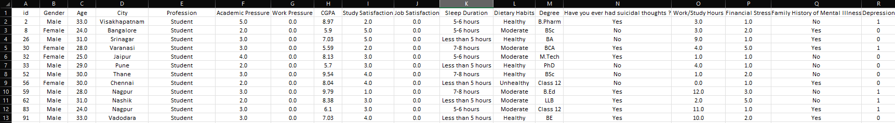

# **Student Depression Dataset Analysis**

## Considerações Iniciais  
Esse projeto vou fazer analises sobre um dataset que fala sobre o índice de depressão nos estudantes, para aprimorar minhas habilidades com uso do Excel e visualização de dados, procurar fatores que possuem correlação e acarretam numa possível depressão.

## Objetivos
Como objetivos principais para esse projeto fazer analises estatisticas com os dados para gerar insights sobre os fatores determinantes que resultam em depressão nos estudantes e utilizando visualizações gráficas para auxiliar nesses processos.

## Sobre o Dataset
O dataset traz informações importantes e pertinentes que irão ajudar de forma eficiente na analise de quais fatores são importantes e que demonstram uma possível depresão em um aluno.
A baixo falarei mais sobre as variáveis presentes no dataset.
* id: Serve como identificador único de cada aluno
* Gender: Serve para identificar o gênero do estudante entre dois valores Male(Masculino) e Female(Feminino)
* Age: Serve para identificar a idade do estudante, o dataset está na faixa etaria de 18 a 59 anos de idade.
* City: Serve para identificar a cidade do estudante podendo percenter, os valores são referentes as cidades da China e da Índia.
* Profession: Serve para identificar se o indivíduo só estude ou possue uma profissão e estude ao mesmo tempo.
* Academic Pressure: Serve para identificar a pressão academia que o indivíduo possui, entre os valores de 0(nada) a 5(muito alta).
* Work Pressure: Serve para identificar a pressão que a pessoa tem com seu serviço, entre os valores de 0(nada) a 5(muito alta).
* CGFP: Serve para informar a média de notas e pontuações academicas do indivíduo.
* Study Satisfaction: Serve para informar a satisfação acadêmica do estudante, entre os valores de 0(nada) a 5(muito alta).
* Job Satisfaction: Serve para informar a satisfação do estudante com seu serviço, entre os valores 0(muito baixa) a 3(alta).
* Sleep Duration: Serve para informar o tempo de sono que o estudante tem variando entre: 5-6 hours; 7-8 hours; Less Than 5 hours e more than 8 hours.
* Dietary Habits: Serve para informar os hábitos alimentares do estudante variando entre: healthy, moderate, unhealthy e others.
* Degree: Serve para informar o tipo do diploma/curso dos estudantes.
* Have you ever had suicidal thoughts: Serve para informar se o estudante já teve pensamentos suicidas variando entre yes(sim) e no(não).
* Work/Study Hours: Serve para informar o tanto de horas de estudo e serviço do estudante.
* Financial Stress: Serve para informar o tanto de estresse por causa de situações financeiras, variando entre: 1(muito baixo) a 5(muito alto).
* Family History of Mental Illness: Serve para informar se existe histórico familiar sobre doenças mentais.
* Depression: Serve para informar se o estudante possui ou não depressão, variando entre 1(sim) e 0(não).

## Etapas do Projeto
Aqui irei destacar as etapas e processos feitos no dataset para corrigir imprecisões, valores faltantes e também transformação dos seus tipos para ficarem mais legíveis e fáceis de serem analisados e representados em uma visualização por meio de gráficos. 

### Padronização dos tipos dos dados das colunas
Padronizei as colunas (Id, Age, Academic Pressure, Work Pressure, CGPA, Study Satisfaction, Job Satisfaction, Work/Study Hours, Financial Stress e Depression) como número seu formato de dados originais, deixando eficiente para criar analises e diferenciar seus tipos. Nessas colunas também deixei sem casas decimais para ficar mais preciso, exceto a coluna de CGPA que se refere a média das notas do individuo, essa coluna eu deixei com duas casas decimais.

Já as colunas (City, Profession,Degree, Have you ever had suicidal thoughts, Family History of Mental Illness) padronizei tudo como tipos de texto para auxiliar na analise visual a ser feita posteriormente.

### Limpando Valores Impresicos na coluna CGPA
Os valores presentes em grande maioria se apresentam nesse formato: x.xx que se refere a uma média das pontuações acadêmicas dos estudantes entretanto, existe algums falores imprecisos que invés de estarem com (.) eles estão com (,) e outras valores que não possuem um delimitador como (62,63,64,73...) e formam valores errôneos baseados nos valores possíveis para médias acadêmicas.
Outra mudança que realizei foi arredondar de forma mais precisa os números de CGPA pois, existia muitos registros de notas como(5.11, 5.12, 5.13, 5.14) e nesse caso arredondei todos para 5.1 que facilitará na precisão dos dados.

### Limpeza na coluna City
Após uma breve analise nos possíveis valores a essa coluna, existe um valor para cidade que aparece como 3.0, como esse resultado fica bastante errôneo, atribui um novo valor de "Desconhecida" pois, não há nenhuma informação de onde o indivíduo de id 35309 possa morar.

### Mudança do formato dos dados na coluna Sleep Duration
Na coluna Sleep Duration os dados eram strings variando no intervalo de(5-6 hours, 7-8 hours, more than 8 hours, less than 5 hours e others), decidi passar para valores numéricos para facilitar na sua visualização posteriormente sendo os novos valores os seguintes:
Valores Antigos   | Valores Novos
--------- | ------
Others | NA
Less Than 5 hours | 1
5-6 hours | 2
7-8 hours | 3
More than 8 hours | 4

